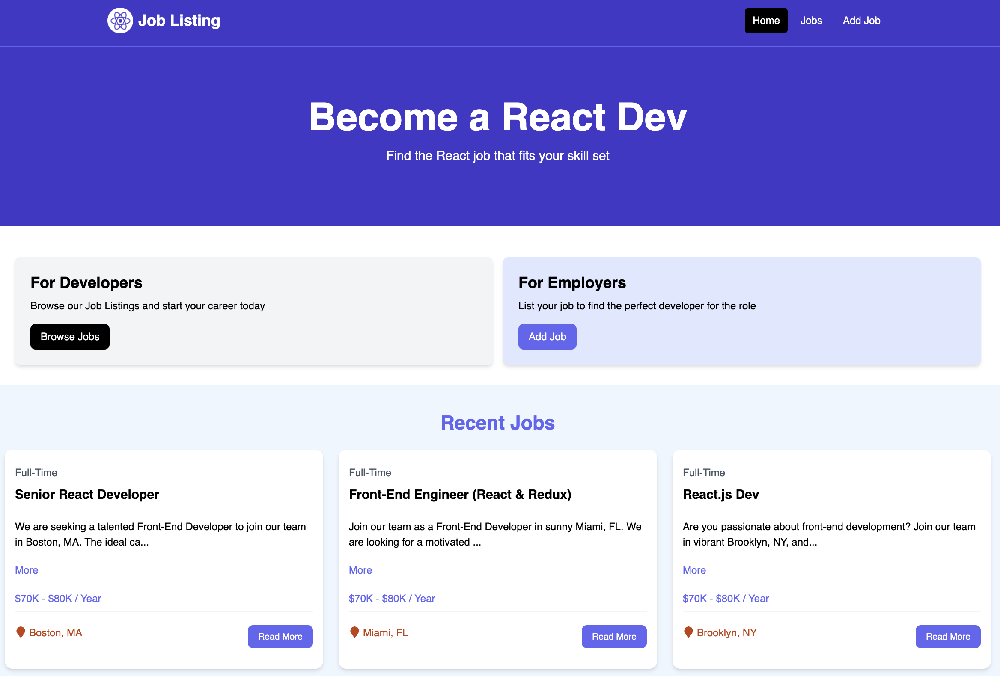
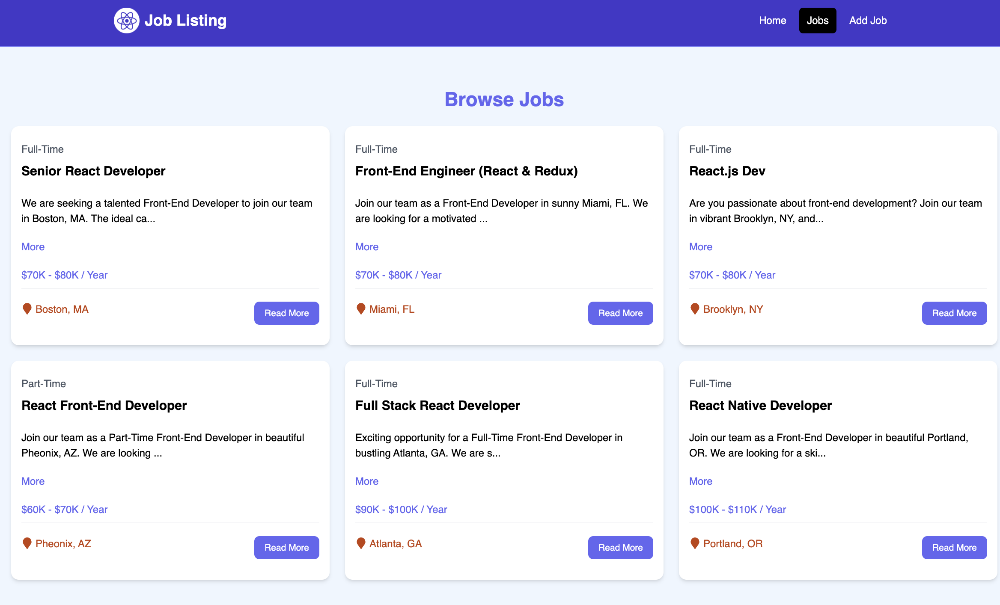
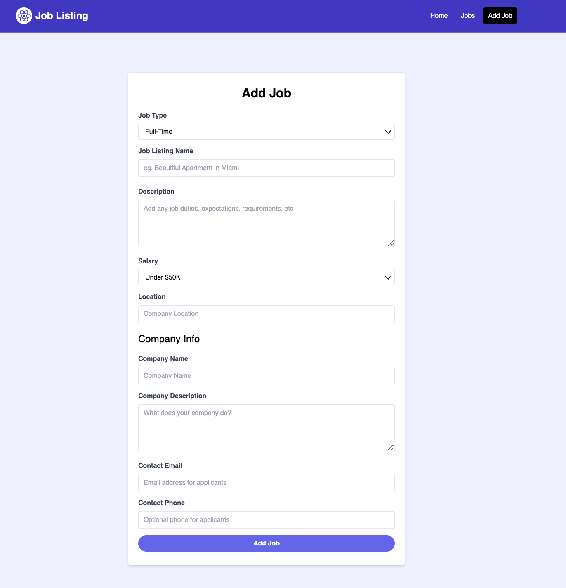

# Job Listing Project 

## Home Page


## Jobs Page


## Add Jobs Page


## Usage

This project uses JSON-Server for a mock backend.

### Install Dependencies

```bash
npm install
```

### Run JSON Server

The server will run on http://localhost:8000

```bash
npm run server
```

### Run Vite Frontend

React will run on http://localhost:3000

```bash
npm run dev
```

### Build for Production

```bash
npm run build
```

### Preview Production Build

```bash
npm run preview
```
